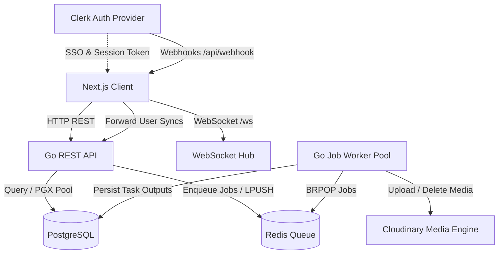
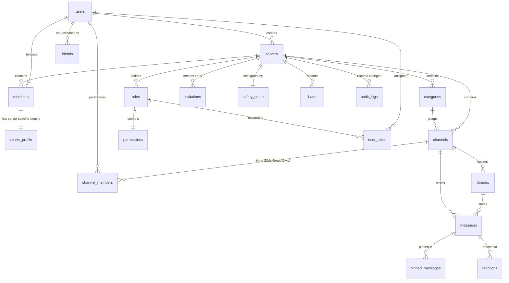
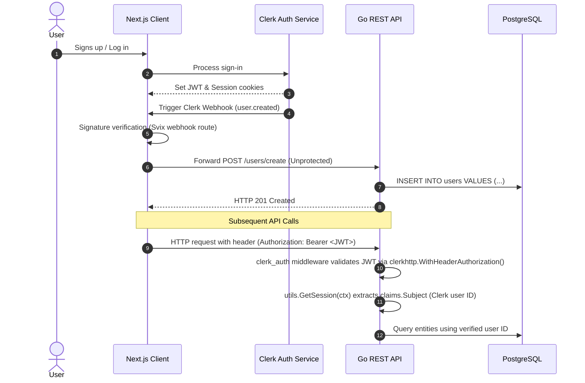
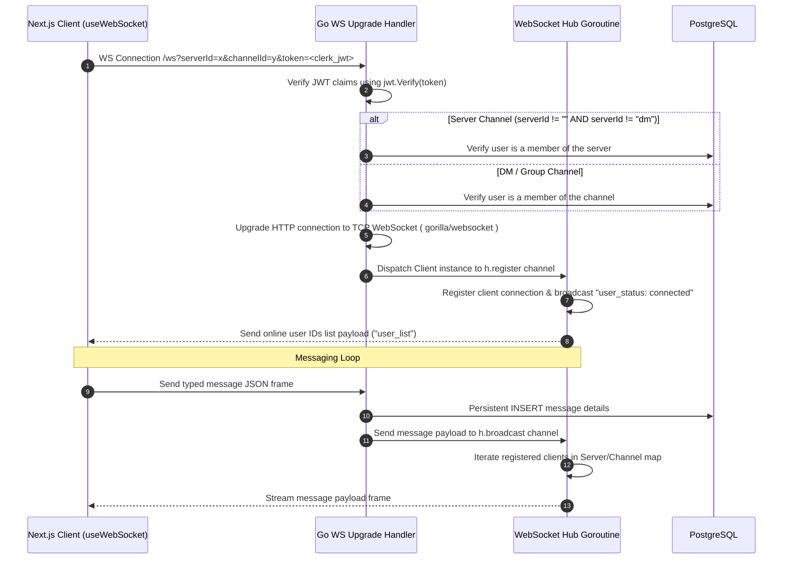
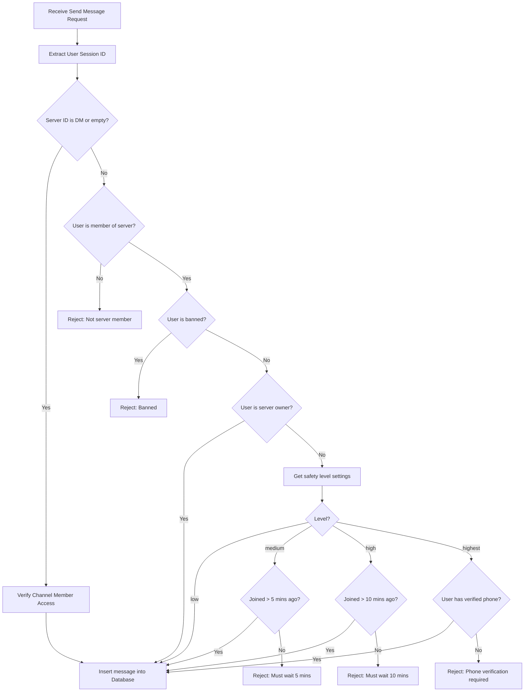
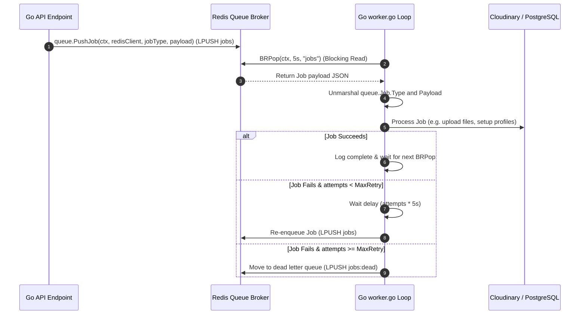

# Cord: Developer Technical Documentation

This document serves as the primary technical reference for developers working on **Cord**, a real-time Discord clone. It describes the system architecture, database models, core application flows, API route definitions, real-time mechanisms, and frontend structuring.

---

## 1. System Architecture Overview

Cord is structured as a decoupled multi-service application consisting of:
*   **Next.js Client Application**: A modern React-based user interface using Tailwind CSS, SWR, and Zustand.
*   **Go REST & WebSocket API**: High-performance HTTP server handling authentication, database updates, and real-time connections.
*   **Go Queue Worker**: A background worker pool that processes deferred, compute-heavy, or async tasks.
*   **PostgreSQL**: relational storage for persistent entities (users, servers, roles, messages, safety configuration, audit logs).
*   **Redis**: Key-value store used as a broker for the asynchronous background job queue and transient presence caching.
*   **Clerk**: Managed authentication identity provider for frontend sign-in/out and JWT-based session security.
*   **Cloudinary**: Media store handling file uploads, image optimizations, and transformations.

### 1.1 Architecture Blueprint



---

## 2. Database Schema & Data Model

The PostgreSQL schema is structured to mirror Discord's guild/channel/role layout with safety levels, bans, reactions, threads, and detailed audit logging.



### 2.1 Schema Breakdown

The persistent layer is defined in [schema.sql](schema.sql):

1.  **`users`**: Represents Clerk authenticated accounts synced locally.
2.  **`servers`**: Guild containers initialized with banner colors and created by an owner.
3.  **`members`**: Intersecting table linking users and servers.
4.  **`server_profile`**: Custom user details scoped to individual servers (nickname, bio, server avatar).
5.  **`categories`**: Group divisions within servers to categorize channels.
6.  **`channels`**: Handles guild text, audio, forum channels, as well as 1:1 Direct Messages (marked by a `dm_key`) and multi-user Group DMs.
7.  **`channel_members`**: Linker table mapping users to private DM channels.
8.  **`threads`**: Group conversations spawned from a parent channel message (`message_id`).
9.  **`messages`**: Multi-location content table. It supports text contents, media attachments, threads mapping, and parent message links (replies hierarchy).
10. **`pinned_messages`**: Bookmarked messages pinned by users in a channel.
11. **`roles`**: Customizable member badges featuring colors, icons, hoisting logic, and permissions mappings.
12. **`permissions`**: Mapped configuration containing dynamic permission arrays (`list varchar(50)[]`) per role.
13. **`user_roles`**: Maps server members to roles.
14. **`invitations`**: Shareable join codes tracking invite counts and limits.
15. **`friends`**: Peer-to-peer relationships containing three states (`pending`, `accepted`, `blocked`).
16. **`safety_setup`**: Server configuration storing protection settings (e.g. phone verification requirements, message limits, spam filtering).
17. **`bans`**: Banned members record.
18. **`audit_logs`**: Chronological repository logging actions performed in the server (e.g., role updates, channel deletions, safety adjustments).
19. **`reactions`**: Emoji reaction list mapped to individual messages.

---

## 3. Core Application Flows

### 3.1 Authentication & User Synchronization Flow

Authentication utilizes Clerk on the frontend and Clerk Go SDK on the backend.



> [!IMPORTANT]
> The database sync endpoints (`/users/create`, `/users/update`, `/users/delete`) in [users_routes.go](backend/internal/routes/users_routes.go) are unprotected by the Clerk auth middleware. Instead, they rely on incoming verification signatures generated by Svix inside Next.js's [webhook route.ts](client/app/api/webhook/route.ts), which ensures requests originate solely from Clerk.

---

### 3.2 Real-time WebSocket Messaging Hub

The real-time layer is managed by the Go WebSocket [hub.go](backend/internal/websocket/hub.go) and upgraded inside [client.go](backend/internal/websocket/client.go).



> [!NOTE]
> Standard WebSocket APIs in the browser do not allow customized headers, so the Clerk session token is passed via query string params (`token=...`) and validated by the backend's `jwt.Verify` during the upgrade request.
>
> The connection upgrade clones claims into a background context using `context.Background()`. This prevents queries inside the WebSocket read/write loops from failing when the upgrade HTTP handler's context terminates.

---

### 3.3 Message Lifecycle & Server Safety Filters

When messages are submitted (either via WebSocket frames or HTTP REST), they undergo validation based on server safety policies in [send.go](backend/internal/services/messages/send.go):



---

### 3.4 Background Queue & Worker System

Asynchronous tasks, audit log persistence, and post-creation setups are offloaded to Redis list brokers processed by [worker.go](backend/internal/worker/worker.go).



The system processes 6 core background jobs defined in [job.go](backend/internal/queue/job.go):

| Job Constant | Purpose | Operations |
| :--- | :--- | :--- |
| `create_channel` | Setup default server layout | Inserts standard `#general` text and audio channels grouped under "text channels" and "audio channels" categories. |
| `create_default_server_profile` | Member profile setup | Populates default server-specific username, avatar, and bio parameters for new members. |
| `create_default_server_safety` | Safety system configuration | Initializes safety settings structure with default `low` level, only mentions notifications, and disabled DM spam filters. |
| `record_audit_log_entry` | Write audit history | Decodes targeted changes payload and writes database records into the `audit_logs` table. |
| `delete_image` | Cleanup Cloudinary media | Invokes Cloudinary SDK `uploader.Destroy` params for image assets. |

---

### 3.5 Roles & Permissions Resolution

Role checks inside [hasPermission.go](backend/internal/services/permissions/hasPermission.go) resolve permissions dynamically:

1.  **Extract identity**: Claims subject extracts user ID.
2.  **Banishment check**: Checks if a ban record exists in `bans` matching the server and user ID.
3.  **Ownership / Role resolving**:
    *   If user ID matches `servers.created_by`, permission is immediately granted (`true`).
    *   Otherwise, the user roles are resolved. It validates whether the target permission string matches any values inside the user's role arrays (`p.list` arrays representing string columns in Postgres).

---

## 4. REST API Route Directory

All endpoints in Cord are defined using Gorilla Mux routing modules.

### 4.1 Server Routes (`/server`)
Mapped in [server_routes.go](backend/internal/routes/server_routes.go):

*   `GET /server`: Fetch server details by ID (`GetServerByID`).
*   `DELETE /server`: Delete server by ID (`DeleteServer`).
*   `GET /server/find-all`: Retrieve all servers matching the current user (`FindAllServersByUserID`).
*   `GET /server/browse`: Browse public/discoverable servers (`BrowseServers`).
*   `POST /server/create`: Create a new server (`CreateServer`). Runs creation tasks inside background workers.
*   `POST /server/join`: Join a server using invitation codes (`JoinServer`).
*   `PATCH /server/update`: Update name, logos, banner colors, privacy status, or description (`UpdateServer`).
*   `GET /server/profile`: Fetch member server-specific profile (`GetServerProfile`).
*   `PATCH /server/profile/update`: Modify server profile details (`UpdateServerProfile`).
*   `GET /server/safety`: Fetch server safety settings (`GetSafetySettings`).
*   `PUT/PATCH /server/safety`: Update server safety settings (`UpdateSafetySettings`).
*   `GET /server/bans`: List banned members (`GetBannedMembers`).
*   `POST /server/bans`: Ban a member (`BanMember`).
*   `DELETE /server/bans`: Unban a member (`UnbanMember`).
*   `GET /server/audit-logs`: Fetch server audit logs (`GetAuditLogs`).

### 4.2 Channels & Categories Routes (`/channel`, `/categories`)
Mapped in [channel_routes.go](backend/internal/routes/channel_routes.go) and [categories_routes.go](backend/internal/routes/categories_routes.go):

*   `GET /channel`: Get channel information by ID (`GetChannelByID`).
*   `POST /channel/create`: Create a channel under a category (`CreateChannel`).
*   `GET /channel/find-all`: List all channels inside a server (`FindAllChannelsInAServer`).
*   `GET /categories`: Retrieve category divisions (`FindAllCategories`).
*   `POST /categories`: Create new category division (`CreateCategory`).

### 4.3 Messages Routes (`/messages`)
Mapped in [messages_routes.go](backend/internal/routes/messages_routes.go):

*   `GET /messages`: Retrieve chronological messages within a channel/thread (`FindAllMessages`).
*   `PATCH /messages`: Edit text contents (`EditMessage`).
*   `DELETE /messages`: Delete messages (`DeleteMessage`). Broadcasts deletion websocket frame.
*   `POST /messages/reactions`: React to a message (`AddReaction`).
*   `DELETE /messages/reactions`: Remove reaction (`RemoveReaction`).
*   `GET /messages/search`: Full-text search content using tsquery queries (`SearchMessage`).
*   `GET /messages/pin/find-all`: Fetch pinned messages (`FindAllPinnedMessages`).
*   `POST /messages/pin`: Pin a message (`PinMessage`).
*   `DELETE /messages/pin`: Unpin a message (`DeletePinnedMessage`).

### 4.4 Threads Routes (`/threads`)
Mapped in [thread_routes.go](backend/internal/routes/thread_routes.go):

*   `GET /threads`: Get thread details (`FindThreadByID`).
*   `POST /threads/create`: Spawn thread from message (`CreateThread`).
*   `DELETE /threads/delete`: Close and remove thread (`DeleteThread`).
*   `GET /threads/find-messages`: Fetch messages linked to a thread (`FindAllThreadMessages`).

### 4.5 Direct Messages & Conversations (`/conversation`)
Mapped in [conversations_routes.go](backend/internal/routes/conversations_routes.go):

*   `GET /conversation`: List user's DM conversations (`FindAllConversations`).
*   `GET /conversation/find-one`: Fetch a single DM conversation by key or ID (`FindConversationByID`).
*   `POST /conversation/create`: Setup new DM session with friend (`CreateConversation`).
*   `DELETE /conversation`: Delete DM conversation (`DeleteConversation`).

---

## 5. Frontend Client Overview

### 5.1 Directory & Layout Hierarchy
Next.js client directories are grouped using route groups in [client/app](client/app):

*   `client/app/(auth)`: Handles Clerk authentication routes (`/sign-in`, `/sign-up`).
*   `client/app/(invite)`: Dynamic routing targeting invitation joins (`/invite/[code]`).
*   `client/app/(main)`: Main layout container containing:
    *   `/direct-messages`: Direct messages panel.
    *   `/browse`: Server discovery page.
    *   `/[id]/[channel_id]`: Messages panel layout.
    *   `/[id]/settings`: Server setup dashboard.

### 5.2 State Management
Shared UI state is managed via Zustand store in [store.ts](client/stores/store.ts):
```typescript
export type StoreState = {
  selectedMsg: Message | null
  isMemberOpen: boolean
  selectedCategory: Category | null
}
```
Queries to API endpoints use SWR to perform caching and revalidations.

---

## 6. Development Reference Checklist

> [!TIP]
> **Port Configuration**:
> *   Go Backend: `http://localhost:8080` (API) & `ws://localhost:8080/ws` (WebSocket)
> *   Frontend client: `http://localhost:3000` (Next.js server)
