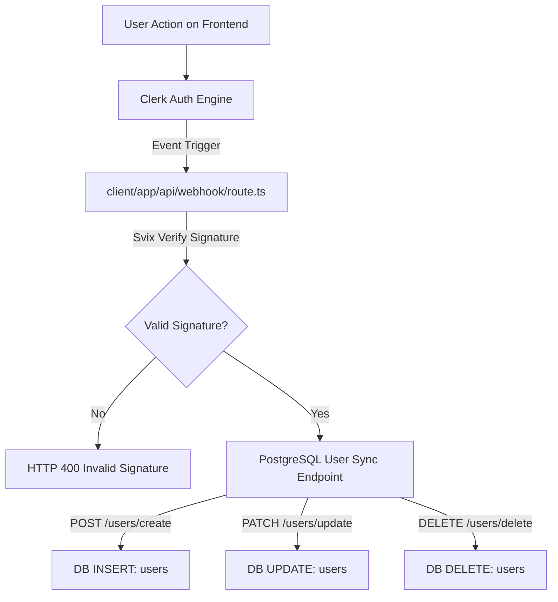
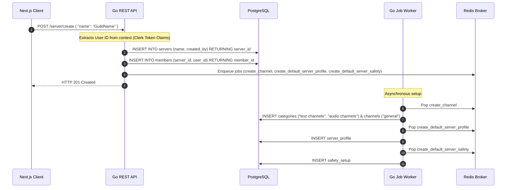
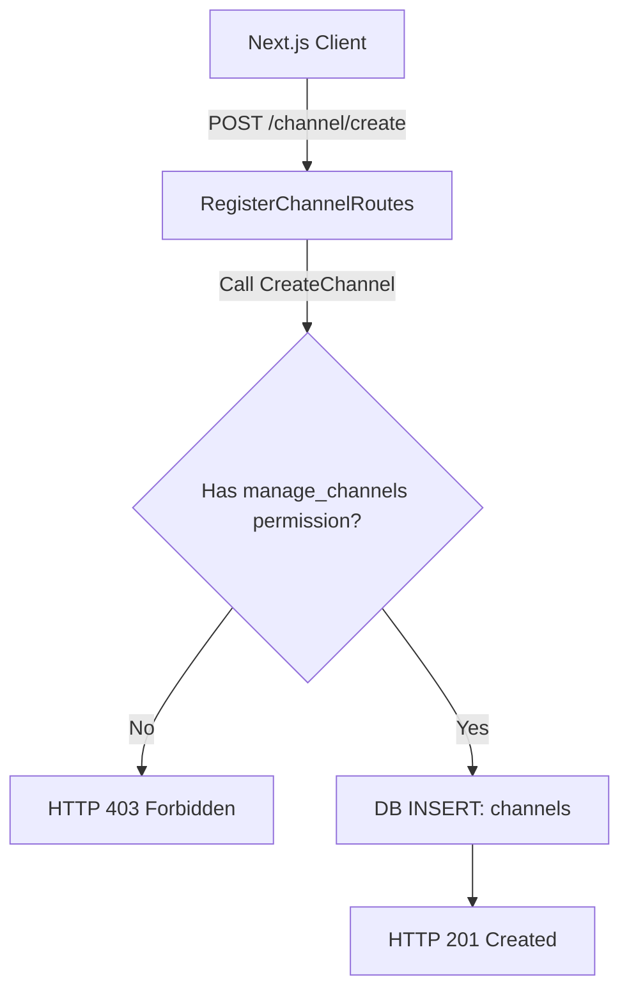
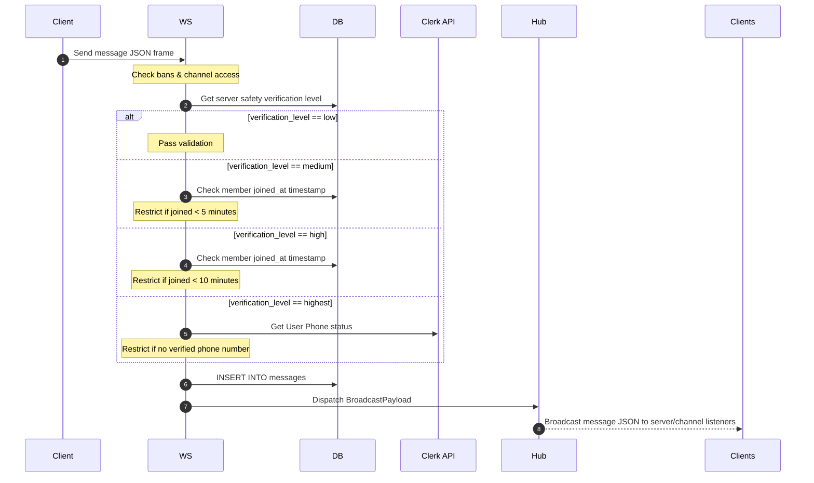
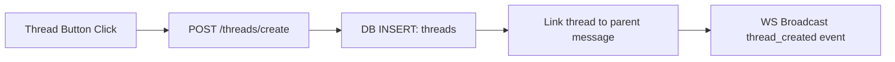
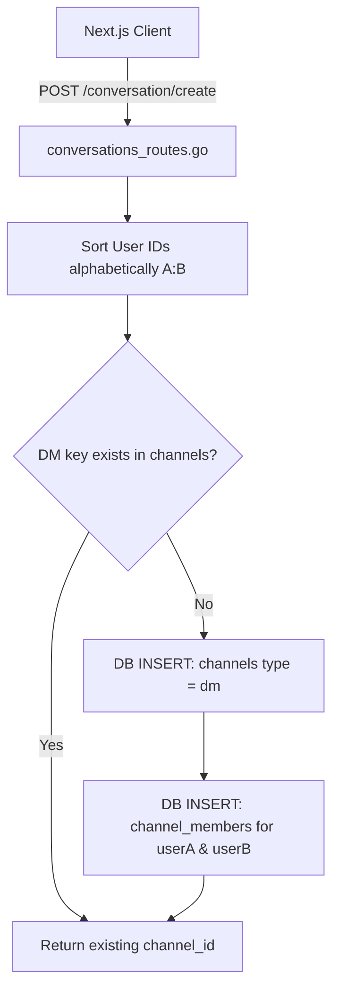
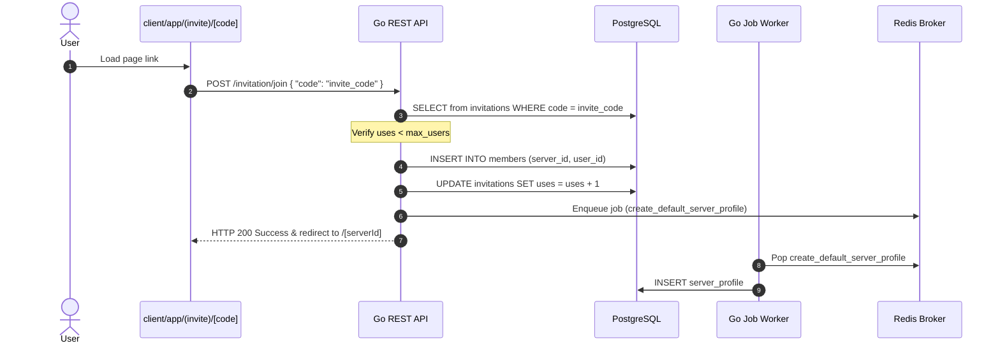
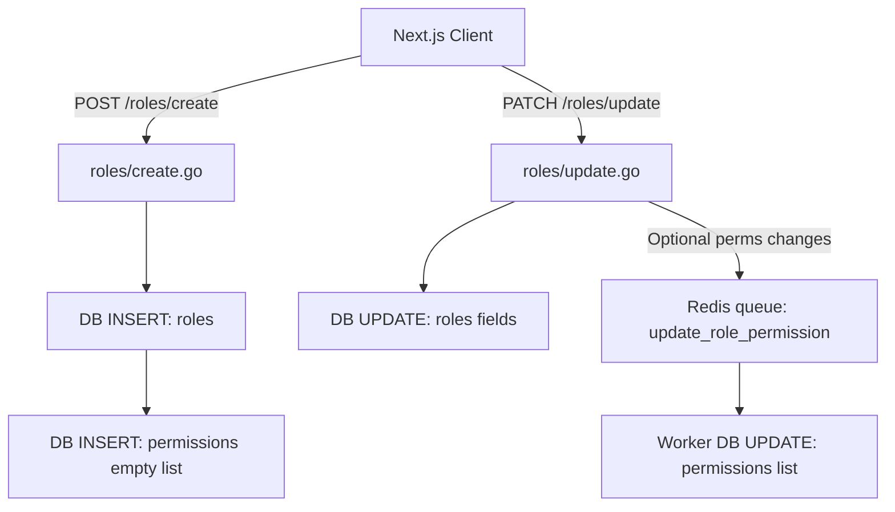

# Cord: Application Feature Flows Documentation

This document describes the step-by-step technical execution flows for all features in the **Cord** platform. It details how operations trigger from the Next.js frontend, execute in the Go backend, trigger Redis jobs, affect PostgreSQL tables, and broadcast real-time events to connected clients.

---

## 1. Authentication & Profile Synchronization Flow

Synchronizes Clerk user registrations, updates, and deletions with PostgreSQL.

### Flow Breakdown
1.  **Trigger**: User signs up, logs in, edits their profile, or deletes their account via Clerk SSO components.
2.  **Auth Webhook**: Clerk issues a webhook event containing payload parameters (`id`, `username`, `image_url`).
3.  **Signature Verification**: [route.ts](client/app/api/webhook/route.ts) validates signature headers (`svix-id`, `svix-timestamp`, `svix-signature`) using the configuration secret `CLERK_WEBHOOK_SIGNING_SECRET`.
4.  **Database Synchronization**:
    *   **Create**: Forwards a payload to the Go REST API `/users/create`. Triggers database statement `INSERT INTO users (id, username, avatar_url, bio, email_verified) VALUES (...)` inside [users.go](backend/internal/handlers/users.go).
    *   **Update**: Forwards payload to `/users/update`. Triggers SQL query `UPDATE users SET username = ..., avatar_url = ..., updated_at = NOW() WHERE id = ...`.
    *   **Delete**: Forwards user ID to `/users/delete`. Triggers `DELETE FROM users WHERE id = ...`. Database constraints cascade deletions across members, servers, profile cards, and messages.

---

## 2. Server Management Lifecycle Flow

### 2.1 Server Creation Flow
Spawns a new server and initiates default channel categorization, profile cards, and safety configs.

#### Flow Steps:
1.  **Request Initiation**: Client calls `/server/create` REST path in [server_routes.go](backend/internal/routes/server_routes.go).
2.  **Synchronous Setup**:
    *   Inserts record into `servers` table returning `server_id` via [create.go](backend/internal/services/servers/create.go).
    *   Inserts the owner member row into the `members` table.
3.  **Asynchronous Setup**: Enqueues three tasks inside the Redis queue broker via [enqueue.go](backend/internal/queue/enqueue.go):
    *   `create_channel`: [defaults.go](backend/internal/services/channels/defaults.go) inserts two categories (`"text channels"` & `"audio channels"`) and creates the `#general` channel for each type.
    *   `create_default_server_profile`: Inserts standard user nickname and avatar into the `server_profile` table.
    *   `create_default_server_safety`: Inserts default settings into `safety_setup` table (Default safety level: `low`).

---

### 2.2 Server Update Flow
Modifies name, logos, banners, visibility, and safety parameters.

1.  **Verification**: Handled in [update.go](backend/internal/services/servers/update.go). Verifies that the requester is the server owner.
2.  **Database Commit**: Executes SQL update against `servers` table columns (`name`, `logo`, `banner`, `banner_colors`, `description`, `private`).
3.  **Auditing**: Compares changed properties. Enqueues a `record_audit_log_entry` task containing before/after details to append history in the `audit_logs` table.

---

### 2.3 Server Deletion Flow
Removes a server and evicts active WebSocket clients.

1.  **API Call**: Calls `DELETE /server?serverID=x` mapping to [delete.go](backend/internal/services/servers/delete.go).
2.  **Database Cascade**: Deletes the target ID matching `servers.id`. PostgreSQL deletes linked members, safety settings, categories, channels, and roles.
3.  **Active Connections Eviction**: The WebSocket Hub evicts and closes connections via `hub.EvictServer(serverId)`. This triggers connection closure for all active clients on the deleted server.

---

## 3. Channel Management Flow

### Flow Breakdown
1.  **Request**: Client calls `POST /channel/create` passing `name`, `channel_type`, `server_id`, and `category_id`.
2.  **Authorize**: [hasPermission.go](backend/internal/services/permissions/hasPermission.go) checks if user is the server owner or possesses `manage_channels` in their active role permissions array.
3.  **Insert**: Inserts the channel into the `channels` table.
4.  **Fetch**: Client retrieves updated channel maps using `GET /channel/find-all?server_id=x`.

---

## 4. Real-time Messaging & Reactions Flow

### 4.1 Message Sending & Validation Flow

#### Flow Steps:
1.  **Write Event**: Client submits a JSON payload to the upgraded WS connection.
2.  **WebSocket Processing**: The `ReadIncomingMessage` goroutine in [client.go](backend/internal/websocket/client.go) captures the bytes frame and calls [send.go](backend/internal/services/messages/send.go).
3.  **Validation Check**:
    *   Verifies channel member access (`VerifyChannelAccess`).
    *   Verifies active bans (`SELECT EXISTS from bans`).
    *   **Safety settings verification**: Reads `safety_setup.level`:
        *   `low`: Allows sending immediately.
        *   `medium`: User must have joined the server at least 5 minutes ago.
        *   `high`: User must have joined the server at least 10 minutes ago.
        *   `highest`: Fetches the user profile from Clerk API and checks if `PhoneNumbers` has a `verified` status.
4.  **Message Insert**: Saves message details into the `messages` table (supports text `content`, parent message replies `parent_msg_id`, or thread mapping `thread_id`).
5.  **Broadcasting**: Sends the new message struct to the hub's `broadcast` channel, which streams it to all target active WebSocket client instances.

---

### 4.2 Message Edit & Deletion Flow

#### Edit:
*   Client calls `PATCH /messages` with the payload `{ "id": "msg_id", "content": "new text" }`.
*   Handler checks message creator ownership (`user_id`). Updates database content.

#### Deletion:
*   Client calls `DELETE /messages` with query parameters.
*   Handler checks ownership or moderator permission (`manage_messages`).
*   Removes row from `messages` table.
*   Calls `hub.BroadcastDelete(serverId, channelId, messageId)` to transmit a `message_deleted` event frame to all active connections.

---

### 4.3 Reactions Flow (Emojis)

1.  **Add Reaction**: Client calls `POST /messages/reactions` with `message_id` and `emoji`. Inserts the reaction into `reactions` table.
2.  **Remove Reaction**: Client calls `DELETE /messages/reactions`. Removes the reaction from `reactions` table.

---

## 5. Threads Configuration Flow

### Flow Breakdown
1.  **Initiation**: User clicks the "Create Thread" button on a message. Client calls `/threads/create`.
2.  **Database Commit**: Creates a row in the `threads` table mapping to `channel_id`, `message_id`, and `name`.
3.  **Message Location Constraint**: Messages created inside threads set `thread_id` to the thread ID, while setting `channel_id` to `NULL`, validating the `message_location_check` SQL check constraint.
4.  **Real-Time Update**: Broadcasts a new thread event to connected clients.

---

## 6. Direct Messages (DMs) & Conversations Flow

Manages 1:1 user direct messaging and private group channels.

### Flow Breakdown
1.  **Start Chat**: User clicks direct message chat target user ID.
2.  **Stable Unique Key**: The API constructs a `dm_key` by sorting user IDs alphabetically (e.g. `userA:userB`).
3.  **Check/Create**:
    *   Queries `channels` checking for matches with type `dm` and `dm_key`.
    *   If missing, inserts channel row (`channel_type = 'dm'`) and adds entries in the `channel_members` table linking both users.
4.  **Messaging**: All Direct Message socket frames match the virtual server path `"dm"`. The WebSocket hub handles broadcast routing specifically to target user channel connections.

---

## 7. Invitations & Server Joins Flow

### Flow Breakdown
1.  **Generate Link**: User generates an invitation link via `/invitation/create` API, inserting a code into `invitations` table.
2.  **Join Server**: An invitee visits the invite link. The client calls `/invitation/join` passing the code.
3.  **Limits Validation**: Validates database invitation row bounds (`uses < max_users`).
4.  **Insert Member**: Inserts a new row in the `members` table and increments the invitation's usage counter (`uses`).
5.  **Profile Initialization**: Enqueues a `create_default_server_profile` background task to populate server nicknames.

---

## 8. Friends Management Flow

Manages user friendship requests.

1.  **Request Send**: Requester inputs a username. API checks target user details and inserts a row in the `friends` table:
    `INSERT INTO friends (requester_id, addressee_id, status) VALUES (userA, userB, 'pending')`
2.  **Pending list**: Recipient views requests using `GET /friends/pending` mapping to [friends.go](backend/internal/handlers/friends.go).
3.  **Resolution**:
    *   **Accept**: Recipient calls `/friends/accept`. Updates status column to `'accepted'`.
    *   **Decline**: Recipient calls `/friends/decline` or `/friends/cancel`. Deletes friendship row.

---

## 9. Roles & Permissions Management Flow

### Flow Breakdown
1.  **Creation**: Client creates a role. [create.go](backend/internal/services/roles/create.go) inserts properties into `roles` table and configures corresponding rows inside the `permissions` table.
2.  **Update**: Handled in [update.go](backend/internal/services/roles/update.go). Role metadata changes (e.g., role `name`, `color`) execute synchronously in PostgreSQL.
3.  **Asynchronous Permissions Mapping**: If roles lists arrays undergo updates, backend enqueues an asynchronous `update_role_permission` job to update permissions.
4.  **Assignment**: API `/roles/assign` maps members to roles in the `user_roles` table.

---

## 10. Server Safety, Bans & Auditing Flows

### 10.1 Safety Settings Updates
*   Client calls `PUT/PATCH /server/safety` mapping to [update.go](backend/internal/services/servers/safety/update.go).
*   Verifies that the requester is the server owner.
*   Inserts or updates configurations in the `safety_setup` table.
*   Diffs parameters and pushes a `record_audit_log_entry` worker job to append changes to audit logs.

### 10.2 Ban Member Flow
*   Client calls `POST /server/bans` passing `user_id` and `reason`.
*   Handler checks permission (`ban_members` or owner) in the database.
*   Inserts record into `bans` table.
*   Kick processes trigger (deletes record in `members` table).
*   WebSocket client connection is terminated via `hub.EvictUser(serverId, userId)`.
*   Enqueues a background job `record_audit_log_entry` to write history logs.
